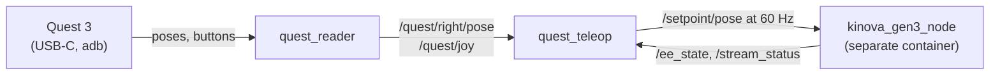

import { Callout } from 'nextra/components'

# Getting started

One worked example, start to finish: **stream Quest poses to a simulated arm
with no headset attached, then swap in the real one.** Docker only. Everything
here runs the same way against the real arm; only the sheppy profile changes.

## What you are talking to



Two nodes in one container. The reader turns the headset's adb stream into two
ROS topics and nothing else; the teleop node owns the arm session. The Xbox
launch has the same shape with `joy_node` in place of the reader.

The arm driver is a second container, and this image does not contain it.
Teleop is a client of the driver's streaming tier, so the driver must be up
before any teleop node is worth starting.

## 1. Start a simulated arm

```sh
docker run --rm -it --network host --ipc host \
  ghcr.io/rammp-org/kinova-gen3-ros2:1.0.1
```

<Callout type="warning">
Both images are **arm64 only**. They build on `rammp-base`, which is published
for the Jetson. On an x86-64 machine `docker run` will not find a matching image.
</Callout>

## 2. Start teleop with a scripted controller

```sh
docker run --rm -it --network host --ipc host \
  ghcr.io/rammp-org/rammp-teleop:0.1.0 \
  /module_ws/src/rammp-teleop/scripts/launch_entry.py rammp_teleop quest.launch.py mock:=true
```

`mock:=true` replaces the headset with a scripted controller that loops
engage, move, grip, release forever. You should see:

```
[quest_teleop]: arm state received
[quest_teleop]: control acquired as 'quest_teleop' (generation 1)
[quest_teleop]: stream open on ee_pose_impedance -> ['pose']
[quest_teleop]: teleop ready on ee_pose_impedance -> /setpoint/pose at 60 Hz
[quest_reader]: quest_reader: MOCK scripted controller, hand=right, 60 Hz
```

The container is started through `launch_entry.py` rather than `ros2 launch`
directly. Humble's `ros2 launch` ignores the SIGTERM that `docker stop` sends
and orphans its nodes; the wrapper turns it into the SIGINT launch honours.

## 3. Check the stream is alive

In a third shell:

```sh
export RMW_IMPLEMENTATION=rmw_cyclonedds_cpp
ros2 topic echo --once --qos-durability transient_local /stream_status
ros2 topic hz --qos-reliability best_effort /setpoint/pose
```

`/stream_status` is latched and should say `open: true` with
`controller: ee_pose_impedance`. The setpoint rate should read about 60 Hz.

**Those QoS flags are required.** The setpoints are best-effort and the status
topics are reliable and latched. Without the matching flag `ros2 topic echo`
prints nothing and looks broken. It is the most common first stumble here,
as it is on the driver.

## 4. The real thing, through sheppy

On the robot, teleop is a node in the December manifest, and a profile selects
one alternative:

```yaml
selections:
  arm: kinova_gen3_driver
  arm_teleop: quest3        # or xbox_pad
```

```sh
sheppy up teleop-quest
```

The `quest3` alternative is the same container as step 2 without `mock:=true`,
plus two mounts that make it survive a restart: the adb key the headset
authorized and the file the calibration gesture writes. Before the first real
run, do the one-time steps in [Setting up the Quest](/rammp-teleop/quest-setup).

For the pad, plug it in, select `xbox_pad`, and check the axis layout with
`ros2 topic echo /joy` if the pad is not an Xbox Series X. The button map is in
the [interface reference](/rammp-teleop/interface#xbox-controls).

## What to expect at the arm

The teleop node opens its stream as soon as it has the arm's state, and from
that moment it publishes a hold target every tick, so the arm switches to the
selected controller and stays put. On `ee_pose_impedance` that hold is
compliant, and the arm may settle a centimetre under gravity.

Then:

- **Engage** by squeezing the grip (Quest) or deflecting a stick (pad). The Quest
  applies the controller's displacement since the squeeze to the EE pose at the
  squeeze; the pad streams a twist proportional to deflection.
- **Release** and the arm freezes where it is. Re-engaging starts a fresh delta
  from the current pose, so the controller never has to be where the arm is.
- **B** on the Quest, or **B** on the pad, publishes the e-stop. The driver
  clears ownership and the node waits for the operator before reacquiring.

Per-tick step caps and a workspace box bound the Quest's motion; the pad's speed
is bounded by its `max_linear` and `max_angular` parameters. All of it is in the
[interface reference](/rammp-teleop/interface#parameters).
