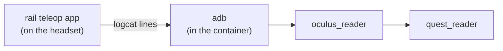

import { Callout } from 'nextra/components'

# Setting up the Quest

The headset plugs into the Jetson over USB-C and is read over adb. Most of this
page is one-time: developer mode, the debugging authorization, and one headset
setting. The calibration gesture at the end is the part you repeat, after every
headset reboot.

## Where the reader gets its data



The headset runs a small Android app from
[rail-berkeley/oculus_reader](https://github.com/rail-berkeley/oculus_reader)
that prints controller poses and buttons to logcat at about 70 Hz. The reader
tails that log over adb. Everything the reader needs (adb, git-lfs, the app's
APK) is in the published image; the first connect pushes the app to the headset.

## One-time headset setup

### Developer mode

Developer mode is gated on membership of a Meta developer organization.
Create or join one at the
[Meta developer portal](https://developer.oculus.com/manage/organizations/create/),
then in the Meta Horizon phone app select the headset, open **Headset
settings**, and turn on **Developer mode**. Reboot the headset.

### Authorize the Jetson, once

Plug the headset into the Jetson and start the `quest3` alternative (or any
container from the image with `/dev` mounted). The headset shows an **Allow
USB debugging?** dialog with the Jetson's key fingerprint.

Put the headset on, tick **Always allow from this computer**, then **Allow**.

<Callout type="warning">
A plain Allow without the tick authorizes one adb server only. Every container
start is a new adb server, so the headset would prompt again each time, and a
headset nobody is wearing cannot show the prompt. The reader then exits with
"device unauthorized".
</Callout>

The key lives in `/home/abra/.android` on the Jetson and the `quest3`
alternative mounts it into the container. Without that mount the key is
regenerated on every start and the authorization is lost with it.

### Turn off controller auto-sleep

With hand tracking's auto-switch on, the headset puts a controller it thinks is
not in a hand to sleep. Its buttons keep working over Bluetooth while its pose
freezes at the last value. This was the most confusing failure in bringing the
pipeline up, because from ROS it looks like the reader stopped updating.

In the headset: **Settings**, **Movement tracking**, turn off **Auto switch
from controllers to hands**. This is not exposed over adb, so it has to be
done in the headset UI.

## What the reader does on every connect

You should not have to do these; they are here so the log makes sense.

- **Waits for the device.** Starting a privileged container resets the
  headset's USB link for a second or two. The reader polls adb until the device
  reports authorized before it opens the stream, up to 15 s.
- **Keeps the headset awake.** A Quest that thinks it is not being worn sleeps
  and stops tracking. The reader sends the wake key, the proximity-sensor
  broadcast (`com.oculus.vrpowermanager.prox_close`) and `svc power stayon usb`,
  then checks `dumpsys power` reports `Awake`. A headset reboot clears this, and
  the next connect re-sends it. To hand the headset back to normal use:
  `adb shell am broadcast -a com.oculus.vrpowermanager.automation_disable`.
- **Relaunches the app if it dies.** The headset app can exit silently, and
  `oculus_reader` would keep returning the last pose forever. A watchdog checks
  its process every 2 s and relaunches it, logging each relaunch.

Each is a parameter on `quest_reader` (`keep_awake`, `app_watchdog_s`) if you
need it off.

## Calibrate after every headset reboot

The Quest reports poses in a frame whose yaw is set when the headset boots. The
node needs the rotation from that frame to the robot base, called `R_align`,
so that moving your hand toward the robot moves the end effector along the
base's +X.

Only the yaw is unknown. The headset frame is gravity-aligned, so roll and
pitch are the fixed swap from the headset's y-up to the robot's z-up. That makes
the calibration a single gesture:

1. With teleop running, **hold A for two seconds.** The log says `CALIBRATING`.
   The arm holds; the grip does not drive it while calibration is armed.
2. **Squeeze the grip, move your hand about 20 cm along the robot's +X** (away
   from the base, in the direction the arm reaches), **release.**
3. The log prints the new triple and saves it. Teleop is live again.

A move shorter than 10 cm or mostly vertical is rejected and you can redo it.
Thirty seconds without a move times out; hold A again.

The result is written to `/home/abra/.config/rammp_teleop/quest_r_align.json`
through the `quest3` alternative's `/config` mount, and it overrides the
`r_align_euler_zyx_deg` triple in `config/quest.yaml` on the next start. A
container restart does not lose it; only a headset reboot invalidates it.

<Callout type="info">
Stand where you will teleoperate from and make the gesture deliberate. A 20 cm
move with 3 cm of sideways drift is a 10 degree yaw error, which you will feel
as the arm veering. If forward is not forward, hold A and do it again.
</Callout>

The three-gesture command-line tool from before this existed still works as a
fallback:

```sh
ros2 run rammp_teleop quest_calibrate
```

Move forward, left and up as prompted and paste the printed triple into
`config/quest.yaml`.

## adb over Wi-Fi

The reader takes a `quest_ip` parameter for adb over the network. You still
need one USB session to enable it (`adb tcpip 5555` on the headset), and the
headset and the Jetson must share a network. The keep-awake step's
`stayon usb` line is moot on Wi-Fi; the proximity broadcast still applies.
